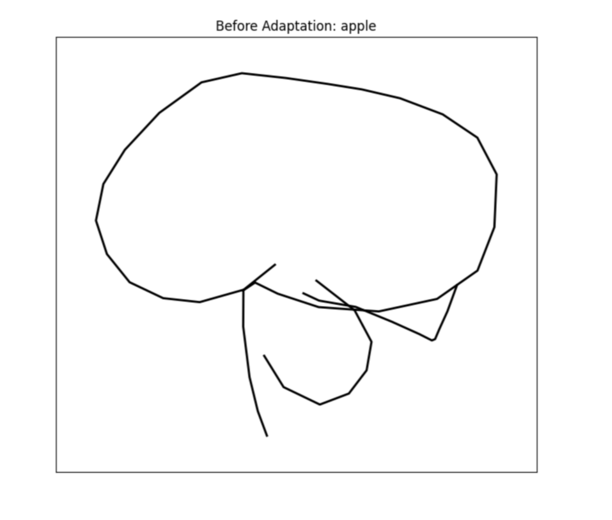
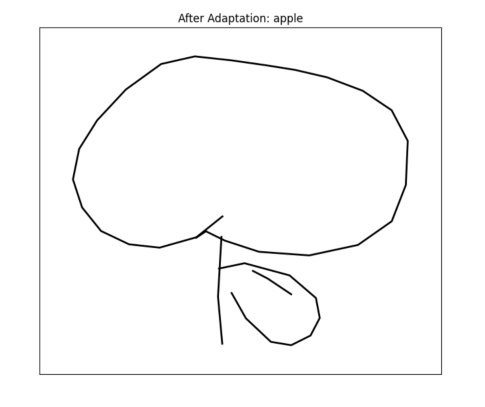

# QuickDraw---Sketch

## Overview 
This project implements a sequential model that takes a class name as input and generates a corresponding sketch as a sequence of strokes. The model captures both structural patterns and temporal dependencies in sketches. An optional extension allows interactive refinement using user feedback.

## Dataset
Dataset: Quick, Draw! Dataset
Each sample contains sequential stroke data for various object categories (e.g., tree, house, car).

Preprocessing steps:

    1.Convert raw strokes to (x, y, state) format.

    2.Normalize coordinates to [0, 1].

    3.Encode pen states: 0 → Pen Down, 1 → Pen Up, 2 → End of Sketch.

    4.Pad/truncate sequences to a fixed length for batch processing.

Splits: 70% train, 15% validation, 15% test.

## Methodology
    1.Load and preprocess sketches into uniform tensors.

    2.Encode class labels as embeddings.

    3.Train a recurrent neural network (LSTM) to predict the next point and pen state.

    4.Use loss functions:

        a.MSE for coordinate prediction.

        b.Cross-entropy for pen state classification.

    5.Optimize with Adam and learning rate scheduling.

## Results
Stroke by stroke generation:

## Feedback-Based Adaptation
The model can refine its output based on user ratings:

